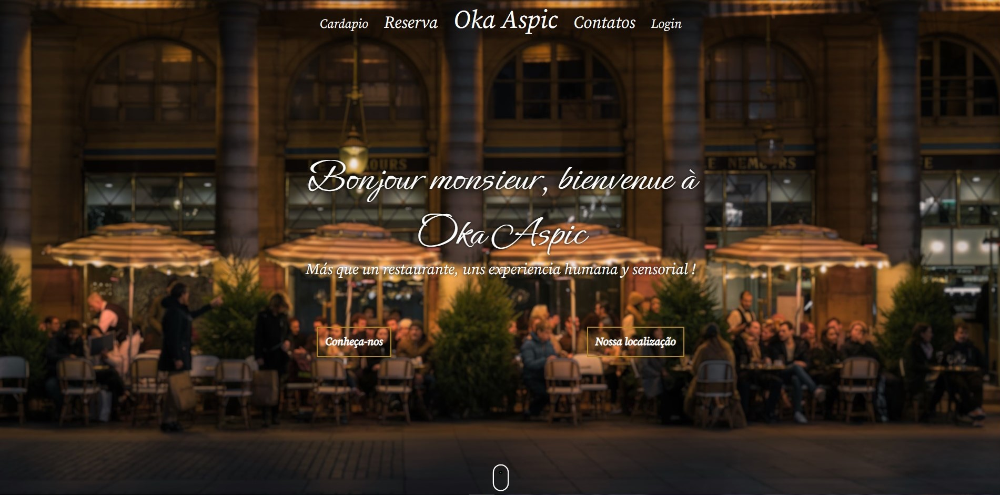
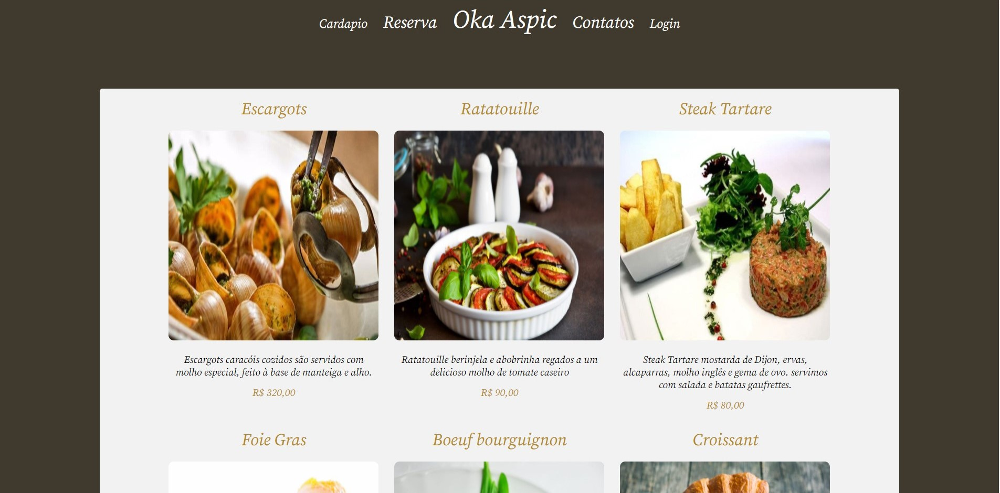

# Projeto Start Oka Aspic
Oka Aspic é um restaurante fundado em 2015, pelo chefe Oliver Rueda que alçou um novo vôo e decidiu unir seus mais de 20 anos de carreira com suas paixões em um só lugar: Oka Aspic.

  
## Tela Home
  
## Tela pratos populares
  
## Tela login

